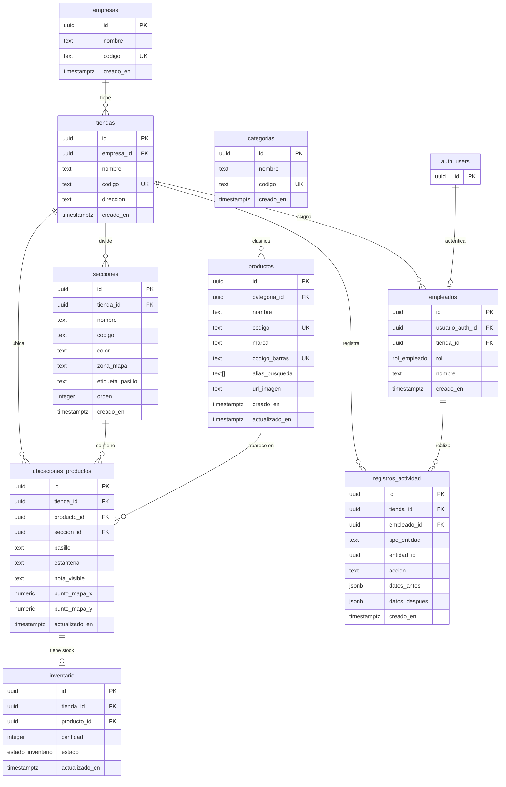

# Modelo de base de datos

Este documento resume el diseño actual de la base de datos de Mapket. Sirve como referencia para revisar relaciones, cardinalidades y restricciones antes de redactar la memoria final.

## Objetivo del modelo

La base de datos separa claramente cuatro áreas:

- estructura de negocio: empresas y tiendas
- mapa de supermercado: secciones de cada tienda
- catálogo y disponibilidad: categorías, productos, ubicaciones e inventario
- administración interna: empleados e historial de actividad

El diseño permite que una misma app soporte varias tiendas sin mezclar datos entre ellas.

## Diagrama ER

## Cardinalidades

- `empresas` 1:N `tiendas`: una empresa puede tener muchas tiendas; cada tienda pertenece a una empresa.
- `tiendas` 1:N `secciones`: una tienda tiene varias secciones; cada sección pertenece a una tienda.
- `tiendas` 1:N `empleados`: una tienda tiene varios empleados; cada empleado pertenece a una tienda.
- `categorias` 1:N `productos`: una categoría puede clasificar varios productos; cada producto tiene una categoría.
- `productos` N:M `tiendas` mediante `ubicaciones_productos`: un producto puede estar en varias tiendas y cada tienda puede tener muchos productos.
- `secciones` 1:N `ubicaciones_productos`: una sección puede contener muchos productos ubicados; cada ubicación pertenece a una sección.
- `ubicaciones_productos` 1:0..1 `inventario`: una ubicación de producto puede tener un registro de inventario; el inventario no puede existir sin ubicación.
- `empleados` 1:N `registros_actividad`: un empleado puede generar muchos registros; el registro conserva la actividad aunque el empleado sea eliminado.
- `tiendas` 1:N `registros_actividad`: cada actividad queda vinculada a la tienda donde ocurrió.
- `auth.users` 1:0..1 `empleados`: un usuario de Supabase Auth puede estar asociado como empleado de una tienda.

## Restricciones principales

- Todas las tablas principales usan `uuid` como clave primaria.
- `empresas.codigo`, `tiendas.codigo`, `categorias.codigo` y `productos.codigo` son únicos para evitar rutas o búsquedas ambiguas.
- `secciones` impide repetir una misma sección dentro de una tienda con `unique (tienda_id, codigo)`.
- `ubicaciones_productos` impide duplicar un producto dentro de la misma tienda con `unique (tienda_id, producto_id)`.
- `inventario` usa `unique (tienda_id, producto_id)` y una clave foránea compuesta hacia `ubicaciones_productos`.
- `inventario.cantidad` no puede ser negativa.
- `ubicaciones_productos.seccion_id` debe pertenecer a la misma tienda indicada en `ubicaciones_productos.tienda_id`.
- `punto_mapa_x` y `punto_mapa_y` están preparados para una mejora futura con posición exacta dentro del mapa. Actualmente la app localiza productos por sección, pasillo y estantería. Si estos campos se usan más adelante, solo aceptarán valores entre 0 y 100.
- `registros_actividad.tipo_entidad` queda limitado a entidades conocidas del sistema.

## Borrados y consistencia

- Al borrar una empresa, se eliminan sus tiendas por `on delete cascade`.
- Al borrar una tienda, se eliminan secciones, ubicaciones, inventario, empleados y actividad de esa tienda.
- Al borrar un producto, se eliminan sus ubicaciones e inventario asociado.
- Al borrar un empleado, sus registros de actividad conservan el histórico con `empleado_id` a `null`.
- Las secciones usan `on delete restrict` en ubicaciones para evitar eliminar una sección que aún contiene productos.

## Índices

- `productos_nombre_idx`: búsqueda de texto en español por nombre de producto.
- `productos_alias_idx`: búsqueda por alias y sinónimos.
- `ubicaciones_productos_tienda_idx`: carga eficiente de productos por tienda y sección.
- `inventario_tienda_estado_idx`: filtros rápidos por tienda y estado de stock.
- `registros_actividad_tienda_creado_idx`: historial ordenado por tienda y fecha.

## Seguridad

La base de datos usa Row Level Security en todas las tablas públicas. Las lecturas necesarias para clientes son públicas, pero las escrituras del panel interno se hacen con sesión de empleado o mediante Edge Functions.

Las funciones auxiliares `tienda_empleado_actual_id()` y `rol_empleado_actual()` centralizan la comprobación de tienda y rol del usuario autenticado.

## Decisiones de diseño

- `ubicaciones_productos` e `inventario` están separados para no mezclar ubicación física y cantidad disponible.
- `registros_actividad` usa `tipo_entidad`, `entidad_id`, `datos_antes` y `datos_despues` porque registra acciones de distintas entidades sin perder histórico.
- `productos` funciona como catálogo global, mientras que `ubicaciones_productos` e `inventario` representan la situación concreta en cada tienda.
- `secciones.zona_mapa` guarda la referencia visual del mapa para conectar la base de datos con el layout interactivo de Vue.
